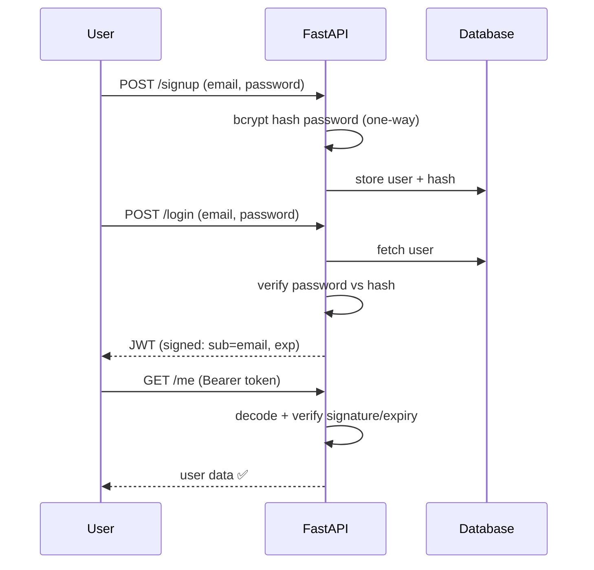
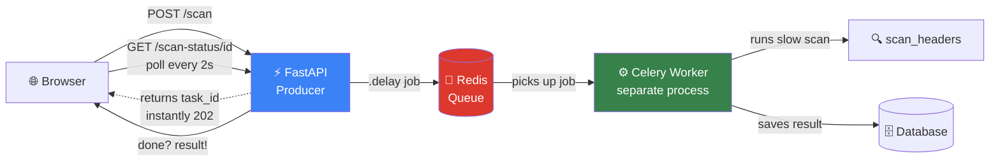
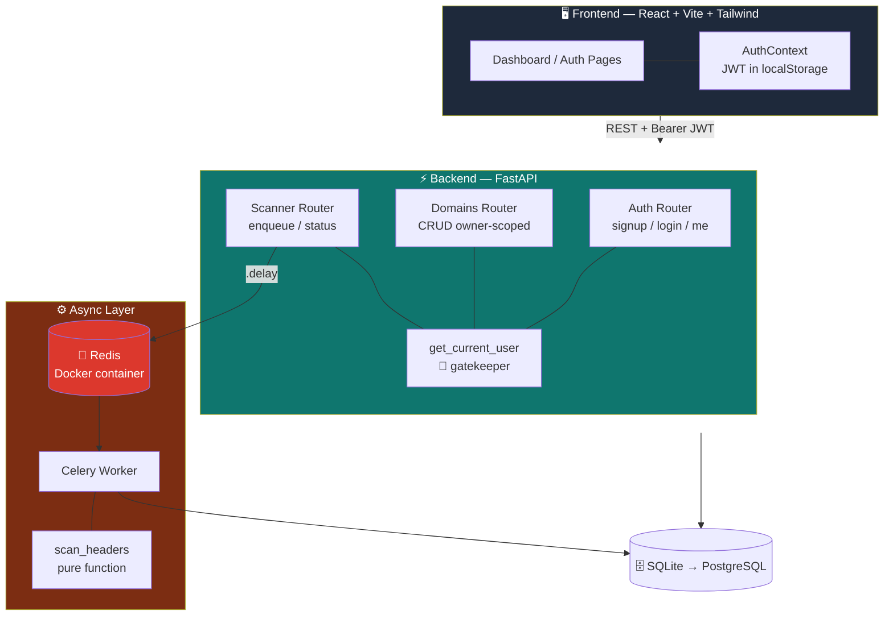
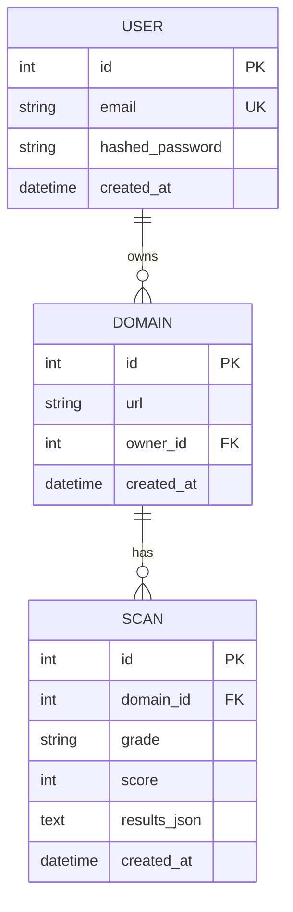
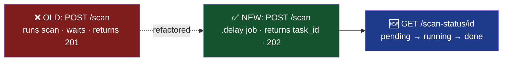
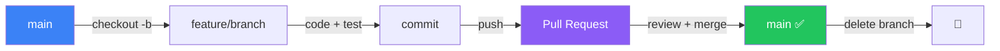

<div align="center">

# 🛡️ SiteShield — Progress Log

### *A living, detailed record of building a multi-tenant SaaS website security scanner — from scratch, step by step.*


> **This document is the single source of truth for understanding SiteShield from scratch.**
> Updated every working day. Read the *mental models* section first — it makes everything else click.

</div>

---

## 📑 Table of Contents

- [📌 What is SiteShield?](#-what-is-siteshield)
- [🧠 Core Mental Models](#-core-mental-models-read-this-first)
- [🏗️ System Architecture](#️-system-architecture)
- [🗂️ Project Structure](#️-project-structure)
- [⚙️ Daily Startup Checklist](#️-daily-startup-checklist)
- [📅 Month 1 — Foundation → Dashboard](#-month-1--foundation--auth--crud--scanner--dashboard)
- [📅 Month 2 — Async Scanning](#-month-2--async-background-scanning-in-progress)
- [⏭️ Roadmap](#️-roadmap)
- [🔁 Git Workflow](#-git-workflow)
- [🎯 Interview Framing](#-why-this-project-matters-interview-framing)

---

## 📌 What is SiteShield?

SiteShield is a **multi-tenant SaaS platform** that audits and monitors a website's **defensive security posture**. A user signs up, adds domains they own, and the platform scans each one for security weaknesses, assigns a weighted **A–F grade**, stores scan history, and (later) monitors on a schedule with alerts and reports.

> 🔒 **Every check is passive and defensive** — it only inspects publicly observable configuration, the way a security-conscious admin would. It is a **blue-team tool, not an attack tool.**

| | |
|---|---|
| 🎯 **Goal** | Grade & monitor website security posture (headers → TLS → DNS → CVEs) |
| 🧩 **Pattern** | Multi-tenant SaaS with per-user data isolation |
| ⚡ **Architecture** | Async background scanning via a Redis-backed task queue |
| 🏅 **Output** | A–F grade + per-check breakdown + remediation advice |

---

## 🧠 Core Mental Models *(read this first)*

> 💡 These five ideas are the conceptual spine of the whole project. Internalize them and every file makes sense.

<details open>
<summary><b>1️⃣ The Request Lifecycle (FastAPI)</b></summary>

<br>

Every request flows in one direction:

```
Router  →  Dependencies  →  Database  →  Response
```

**Dependencies** are reusable functions FastAPI injects automatically (the DB session, the logged-in user). Once this pattern clicks, the rest of the backend is just *more routers*.

</details>

<details open>
<summary><b>2️⃣ Models vs Schemas (why there are two)</b></summary>

<br>

| | File | Represents |
|---|---|---|
| **Models** | `models.py` | The **database** shape (SQLAlchemy tables) |
| **Schemas** | `schemas.py` | The **API** shape (Pydantic — JSON in/out) |

Keeping them separate is *exactly* why `hashed_password` can never leak — the output schema (`UserOut`) simply doesn't contain that field.

</details>

<details open>
<summary><b>3️⃣ JWT Authentication Flow</b></summary>

<br>



Tamper with the token → signature check fails → **401**.

</details>

<details open>
<summary><b>4️⃣ Multi-Tenant Isolation (IDOR Protection)</b></summary>

<br>

Every query touching user-owned data filters on **`owner_id == current_user.id`**.

```python
# ❌ Vulnerable (IDOR): trusts the id alone
db.query(Domain).filter(Domain.id == domain_id).first()

# ✅ Safe: id AND owner together
db.query(Domain).filter(
    Domain.id == domain_id,
    Domain.owner_id == current_user.id
).first()
```

So user A can never read or delete user B's data — even guessing the id returns **404**. This blocks **IDOR** (Insecure Direct Object Reference), a classic web vuln. Applied consistently on *every* domain and scan endpoint.

</details>

<details open>
<summary><b>5️⃣ Async Task Queue (Producer → Queue → Worker)</b></summary>

<br>

The production pattern that decouples *asking* for a scan from *doing* it:



> 🍽️ **Restaurant analogy:** You (browser) order from the waiter (API), who pins a ticket to the kitchen rail (Redis) and *immediately* serves the next table. The cook (Celery worker) pulls tickets and cooks. You hold a buzzer (task_id) that lights up when ready. The waiter never freezes at your table waiting for the food.

</details>

---

## 🏗️ System Architecture



---

## 🗂️ Project Structure

```
SiteShield-Web/
│
├── 🐍 backend/
│   ├── app/
│   │   ├── main.py              # FastAPI app · CORS · router registration · table creation
│   │   ├── config.py            # Settings from .env (pydantic-settings)
│   │   ├── database.py          # engine · SessionLocal · Base · get_db dependency
│   │   ├── models.py            # User · Domain · Scan tables
│   │   ├── schemas.py           # Pydantic request/response shapes
│   │   ├── celery_app.py        # Celery instance (broker + backend = Redis)
│   │   ├── auth/
│   │   │   ├── security.py      # hash/verify password · create/decode JWT
│   │   │   ├── dependencies.py  # get_current_user  🔐 the gatekeeper
│   │   │   └── router.py        # /auth/signup · /login · /me
│   │   ├── domains/
│   │   │   └── router.py        # CRUD — add/list/get/delete (owner-scoped)
│   │   └── scanner/
│   │       ├── headers.py       # 🔍 pure scan logic (decoupled, reusable)
│   │       ├── tasks.py         # Celery task: scan + persist
│   │       └── router.py        # /scan (enqueue) · /scan-status · /scans
│   ├── .env                     # 🔑 secrets + config (gitignored)
│   ├── requirements.txt
│   └── siteshield.db            # SQLite dev DB (gitignored)
│
└── ⚛️ frontend/
    ├── src/
    │   ├── api/
    │   │   ├── client.js         # fetch wrapper: base URL · token · error normalization
    │   │   ├── auth.js           # signup / login / getMe
    │   │   └── domains.js        # domain + scan calls
    │   ├── context/
    │   │   └── AuthContext.jsx   # 🌐 app-wide auth state
    │   ├── components/
    │   │   ├── AuthForm.jsx · AddDomainForm.jsx · DomainCard.jsx
    │   │   ├── ScanResult.jsx · GradeBadge.jsx · ProtectedRoute.jsx
    │   ├── pages/                # Login · Signup · Dashboard
    │   ├── App.jsx               # routing · theme toggle · header
    │   └── main.jsx              # entry — wraps app in AuthProvider
    ├── tailwind.config.js        # darkMode: "class"
    └── vite.config.js            # port pinned → 5173
```

---

## ⚙️ Daily Startup Checklist

> Four processes, each in its own terminal:

| # | Process | Command |
|---|---------|---------|
| 1 | 📮 **Redis** | `docker start siteshield-redis` *(after starting Docker Desktop)* |
| 2 | ⚡ **Backend** | `cd backend` → `venv\Scripts\activate` → `uvicorn app.main:app --reload` |
| 3 | ⚙️ **Worker** | `cd backend` → `venv\Scripts\activate` → `celery -A app.celery_app.celery_app worker --loglevel=info --pool=solo` |
| 4 | ⚛️ **Frontend** | `cd frontend` → `npm run dev` |

**URLs:** API docs → `http://127.0.0.1:8000/docs` · Frontend → `http://localhost:5173`

**Wind-down:** `Ctrl+C` each terminal · `docker stop siteshield-redis`

> ⚠️ **Windows gotcha:** the Celery worker **must** use `--pool=solo`. Celery's default forking pool doesn't work on Windows — this is the #1 Celery-on-Windows error.

---

## 📅 Month 1 — Foundation → Auth → CRUD → Scanner → Dashboard


### 🏗️ Backend Foundation

<details open>
<summary><b>Environment, Config & Database</b></summary>

<br>

**Dependencies:** `fastapi`, `uvicorn[standard]`, `sqlalchemy`, `pydantic-settings`, `pydantic[email]`, `PyJWT`, `bcrypt`, `python-multipart`.

> 🔑 `python-multipart` is required for the OAuth2 login form (login uses form data, not JSON) — easy to forget, cryptic error without it.

- **`config.py`** — `pydantic-settings` loads `.env` once into a single `settings` object. JWT secret generated via `secrets.token_hex(32)`.
- **`database.py`** — `engine` (DB connection), `SessionLocal` (per-request session factory), `Base` (declarative base), and `get_db()` which **guarantees the session closes** via try/finally.
- Started on **SQLite** (zero setup). Switching to **PostgreSQL** for production = a **one-line `.env` change** — the entire point of using an ORM.

</details>

<details>
<summary><b>Models — the 3 database tables</b></summary>

<br>



All three defined up-front (complete schema, no mid-build migrations). `cascade="all, delete-orphan"` → deleting a user auto-deletes their domains and scans.

</details>

<details>
<summary><b>Schemas, Security, Auth gatekeeper & Router</b></summary>

<br>

- **Schemas:** `UserCreate` (input) · `UserOut` (output — **no password field**, can't leak) · `Token`.
- **`security.py`:** bcrypt `hash_password`/`verify_password`; `create_access_token` (JWT with `sub`+`exp`); `decode_access_token`.
- **`dependencies.py` — `get_current_user`:** the 🔐 gatekeeper. Pulls the token, decodes it, returns the `User` or raises 401. Any endpoint adding `Depends(get_current_user)` is protected.
- **Auth router:** `POST /auth/signup` (rejects duplicates, 201) · `POST /auth/login` (OAuth2 form — **email goes in the `username` field**) · `GET /auth/me` (protected).
- **`main.py`:** creates tables on first run · **CORS** lets frontend (5173) call API (8000) · `/health` endpoint.

</details>

> ✅ **Verified:** signup → authorize → `/auth/me` all correct via `/docs`.

---

### 🌐 Domain CRUD

All endpoints owner-scoped. The **URL validator** trims whitespace, rejects empty, prepends `https://` if no scheme, strips trailing slash, and rejects per-user duplicates.

| Endpoint | Action | Status |
|----------|--------|--------|
| `POST /domains` | Add (normalized + deduped) | 201 |
| `GET /domains` | List (newest first) | 200 |
| `GET /domains/{id}` | Get one (id **+** owner_id) | 200 |
| `DELETE /domains/{id}` | Delete one owned | 204 |

> 🛡️ **Key security pattern:** `get` and `delete` filter by `id` **AND** `owner_id` together. Another user's id → 404. This is **IDOR protection** in action.

> ✅ **Verified:** add returns normalized `https://` URL · multi-tenant isolation confirmed (second user sees empty list).

---

### 🔍 Synchronous Header Scanner

The scan logic (`headers.py`) was deliberately kept as a **pure function** — no FastAPI, no DB. *(This decoupling paid off massively in Month 2 — it dropped straight into a Celery worker untouched.)*

**6 weighted security headers:**

| Header | Weight | Why it matters |
|--------|:------:|----------------|
| 🥇 Content-Security-Policy | **25** | Strongest defense against XSS / injection |
| 🥈 Strict-Transport-Security | **20** | Forces HTTPS, prevents downgrade attacks |
| X-Frame-Options | 15 | Blocks clickjacking via iframes |
| X-Content-Type-Options | 15 | Stops MIME-sniffing (`nosniff`) |
| Referrer-Policy | 15 | Limits referrer info leakage |
| Permissions-Policy | 10 | Restricts browser features (camera/mic/geo) |

**Grade bands:** `A ≥ 90` · `B ≥ 75` · `C ≥ 60` · `D ≥ 40` · `E ≥ 20` · `F < 20`

> ✅ **Verified live:**
> - 🟢 **github.com → A (90/100)** — only missing Permissions-Policy (−10)
> - 🔴 **example.com → F (0/100)** — bare site, zero security headers
>
> Real contrast across the spectrum proves the scoring engine works.

---

### ⚛️ React Frontend (4 Stages)

<details>
<summary><b>Stage 1 — Scaffold + Tailwind + dark/light theme</b></summary>

<br>

Vite React app · Tailwind v3 (`darkMode: "class"`) · port pinned to 5173 (matches CORS). Theme toggle adds/removes `dark` class on `<html>`, saved to localStorage (survives refresh). Every color written as `light-value dark:dark-value`.

</details>

<details>
<summary><b>Stage 2 — API client + Auth context (the bridge layer)</b></summary>

<br>

- **`client.js`** — `fetch` wrapper: attaches JWT, handles JSON **and** form-encoded bodies (login uses form data), and **normalizes FastAPI errors** (`detail` can be string or list) into one clean message.
- **`AuthContext.jsx`** — app-wide auth via React Context. On load, verifies any saved token via `/auth/me` (clears if expired). Exposes `user`, `isAuthenticated`, `loading`, `login`, `signup` (auto-logs-in), `logout` via the `useAuth()` hook.
- The `loading` flag prevents a login-screen **flash** on refresh.

</details>

<details>
<summary><b>Stage 3 — Login/Signup + routing + protected routes</b></summary>

<br>

React Router · routes `/login`, `/signup`, protected `/`. Shared `AuthForm` (mode-driven) · `ProtectedRoute` shows "Loading…" then renders or redirects. Header shows email + logout when authed.

> ✅ **Verified:** signup → auto-login → dashboard · logout → login · **refresh keeps session** (token restored, not kicked out).

</details>

<details>
<summary><b>Stage 4 — Domain management + visual scan results</b></summary>

<br>

- `Dashboard` loads domains on mount; add **prepends** (instant UI); delete updates DB + local state.
- `GradeBadge` — colored A–F circle (🟢 green A → 🔴 red F).
- `ScanResult` — badge + per-header checklist: ✓ present (shows value) / ✗ missing (amber advice).
- `DomainCard` — holds its **own** scan state, so cards scan independently.

> ✅ **Verified:** add/list/delete persist across refresh · github.com renders **A** badge + checklist · example.com renders low grade. Full frontend↔backend pipeline works visually.

</details>

> 🐛 **Fix logged:** date in `DomainCard.jsx` → `new Date(created_at + "Z").toLocaleDateString("en-GB")` (`+"Z"` marks UTC → converts to IST; `en-GB` = DD/MM/YYYY).
> 📌 **TODO @ PostgreSQL migration:** remove the `+"Z"` patch — Postgres emits proper offsets, so it'd double-offset.

---

## 📅 Month 2 — Async Background Scanning *(in progress)*

### 📮 Redis via Docker

> Chose **Docker over WSL2-native Redis** for *maximum production tooling exposure* — advances the Month 4 containerization story.

```bash
docker run -d --name siteshield-redis -p 6379:6379 redis
```

| Flag | Meaning |
|------|---------|
| `-d` | detached (background) |
| `--name` | friendly name for later reference |
| `-p 6379:6379` | map container port → host, so FastAPI reaches `localhost:6379` |
| `redis` | image (auto-pulled from Docker Hub) |

> ✅ **Verified:** `docker exec -it siteshield-redis redis-cli ping` → **PONG**
> 🔁 **Daily:** `docker start siteshield-redis` *(NOT `run` again — `run` creates, `start` wakes the existing container)*

### ⚙️ Celery + Redis Wiring

- **`celery_app.py`** — the Celery instance. `broker` (jobs in) + `backend` (results out) both point at Redis. `autodiscover_tasks(["app.scanner"])` finds tasks.
- **`tasks.py`** — `run_domain_scan(domain_id, url)` as a `@celery_app.task`. **Reuses `scan_headers` untouched** (the decoupling payoff 🎉). The worker opens its **own** `SessionLocal()` — it's a separate process and can't use request-scoped `get_db`.

### 🔄 Endpoint Rewrite (sync → async)



- `POST /domains/{id}/scan` → **enqueues** via `.delay(...)`, returns `{task_id, status}` **instantly** (HTTP **202**).
- `GET /domains/scan-status/{task_id}` → **new poller**, maps Celery states (PENDING/STARTED/SUCCESS/FAILURE) → clean statuses; includes result on success.

### 🚀 Worker Launched & Full Loop Verified

```
[tasks]
  . run_domain_scan
Connected to redis://localhost:6379/0
celery@LAPTOP ready.
─────────────────────────────────────────
Task run_domain_scan[20ac3fd4…] received
HTTP Request: GET https://example.com "200 OK"
Task run_domain_scan[20ac3fd4…] succeeded in 0.83s:
  {'scan_id': 3, 'grade': 'F', 'score': 0, …}
```

> ✅ **Core Month 2 milestone achieved.** POSTed a scan → got `task_id` instantly → **watched the worker pick it up live** in a separate process. Genuine producer→queue→worker pipeline working end to end. The API never did the work — the worker did.

> 🔧 **Note:** VS Code "Import could not be resolved" squiggles = wrong interpreter. Fix: `Ctrl+Shift+P` → *Python: Select Interpreter* → `backend\venv\Scripts\python.exe`. Cosmetic only — the running worker proves imports work.

---

## ⏭️ Roadmap

**Month 2 remainder**
- [ ] 🖱️ **Frontend enqueue-and-poll** — "Scan now" calls enqueue, polls `/scan-status` every ~2s, shows live "Scanning…" state
- [ ] 🔐 **TLS/SSL scanner** — protocol versions, cipher strength, cert expiry
- [ ] 🍪 **Cookie flags** — Secure, HttpOnly, SameSite
- [ ] 🌐 **DNS hygiene** — SPF, DMARC, DNSSEC
- [ ] 📊 **Scoring engine v2** — combine all categories
- [ ] 🔀 PR + merge `feature/async-scanning`

**Month 3–5**
- [ ] ⏰ Scheduled re-scans (Celery beat) · 📈 history/trend charts · 📄 PDF reports (ReportLab)
- [ ] 🚨 Email alerts on regression · 🔎 dependency CVE checks (OSV/NVD)
- [ ] 🛡️ Rate limiting · 🧪 test suite · ⚙️ GitHub Actions CI/CD
- [ ] 🐘 SQLite→PostgreSQL migration · ☁️ deploy (Render/Railway) · 🎨 UI polish (dark cinematic)

---

## 🔁 Git Workflow



```bash
git checkout main && git pull          # start fresh
git checkout -b feature/<name>          # BRANCH FIRST (before writing code)
# … build + test …
git add . && git commit -m "feat: …"
git push -u origin feature/<name>
# open PR → merge → delete branch
git checkout main && git pull           # sync local
```

> 📝 **Lesson learned:** always create the branch *before* writing code, so commits have somewhere of their own to land. (Early on a commit went straight to `main` — harmless solo, but correct order avoids it.)

**Branches:** `feature/domain-crud` · `feature/header-scanner` · `feature/react-dashboard` · `feature/async-scanning` *(current)*

---

## 🎯 Why This Project Matters *(Interview Framing)*

> SiteShield demonstrates, in **one project**, what most candidates can't show in five:

| Skill | How SiteShield proves it |
|-------|--------------------------|
| 🏛️ **System design** | Pure scan logic decoupled → moved sync endpoint → async worker with **zero rewrite** |
| ⚡ **Async architecture** | Real producer→queue→worker (Celery + Redis), not a toy |
| 🛡️ **Security awareness** | IDOR-safe scoping on every endpoint · bcrypt · JWT · defensive-only scanning |
| 🐳 **Production tooling** | Docker · FastAPI · React · clear path to CI/CD + cloud |
| 🎨 **Full-stack range** | Typed API backend + polished React SPA (auth, routing, theming) |

> 💬 **When asked "tell me about a project" — this is the one.**

---

<div align="center">

*📌 Last updated: end of Month 2 async-pipeline milestone.*
*▶️ Next session: frontend enqueue-and-poll.*

**Built from scratch · documented every step · understood thoroughly.**

</div>
