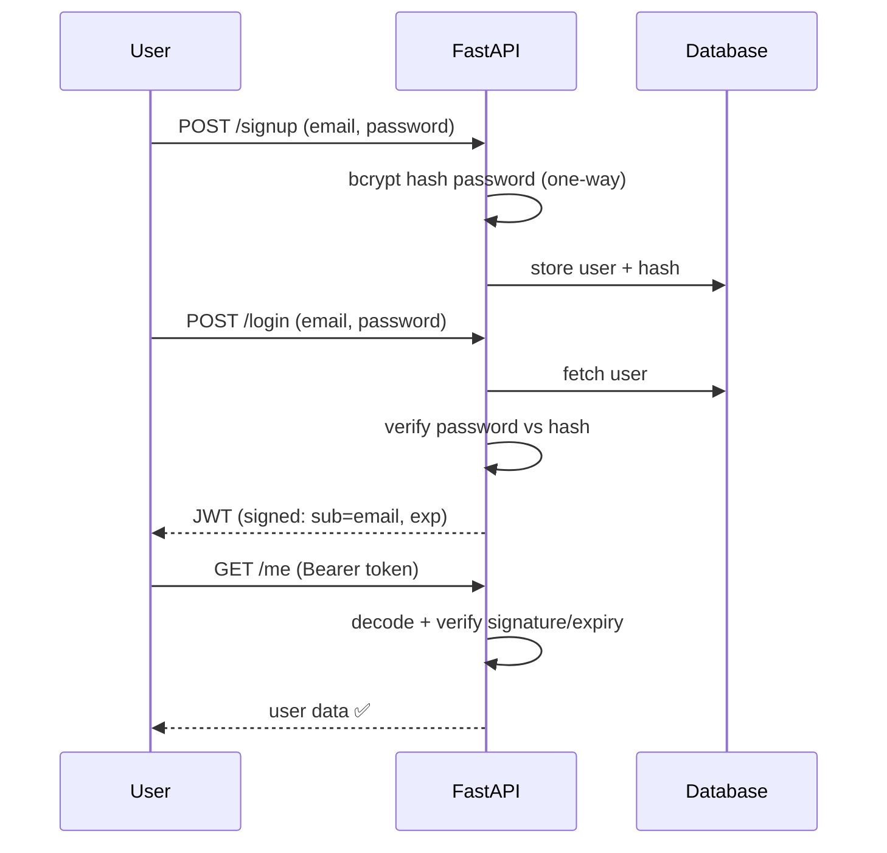
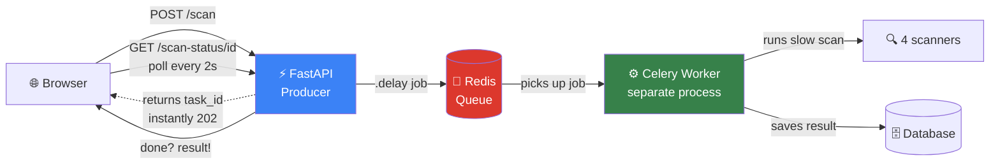
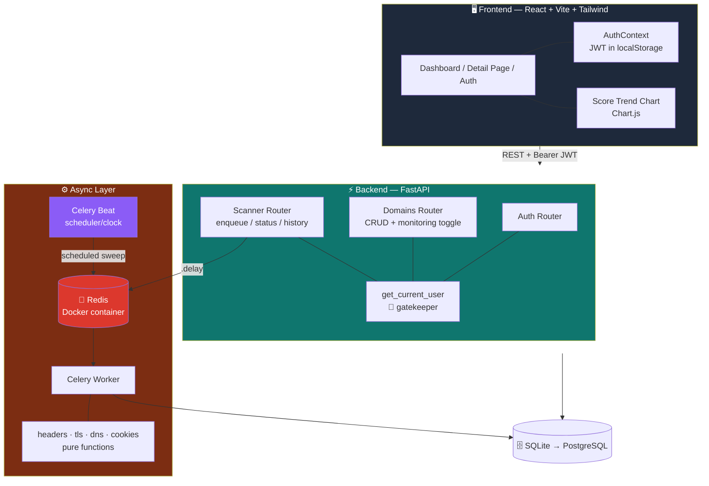
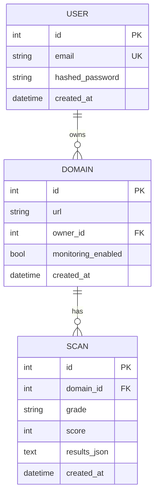
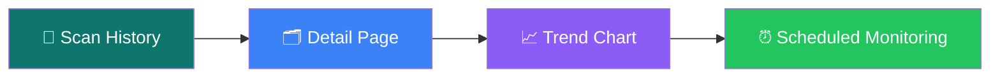
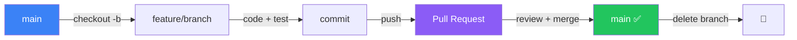

<div align="center">

# 🛡️ SiteShield — Progress Log

### *A living, detailed record of building a multi-tenant SaaS website security scanner — from scratch, step by step.*


> **This document is the single source of truth for understanding SiteShield from scratch.**
> Updated every working day. Read the *mental models* section first — it makes everything else click.

</div>

---

## 📑 Table of Contents

- [📌 What is SiteShield?](#-what-is-siteshield)
- [🧠 Core Mental Models](#-core-mental-models-read-this-first)
- [🏗️ System Architecture](#️-system-architecture)
- [🗂️ Project Structure](#️-project-structure)
- [⚙️ Daily Startup Checklist](#️-daily-startup-checklist)
- [📅 Month 1 — Foundation → Dashboard](#-month-1--foundation--auth--crud--scanner--dashboard)
- [📅 Month 2 — Async + Multi-Category Scanning](#-month-2--async--multi-category-scanning)
- [📅 Month 3 — Monitoring, History & Trends](#-month-3--monitoring-history--trends)
- [⏭️ Roadmap](#️-roadmap)
- [🔁 Git Workflow](#-git-workflow)
- [🎯 Interview Framing](#-why-this-project-matters-interview-framing)

---

## 📌 What is SiteShield?

SiteShield is a **multi-tenant SaaS platform** that audits and **continuously monitors** a website's **defensive security posture**. A user signs up, adds domains they own, toggles monitoring, and the platform scans each one across **four security categories**, assigns a weighted **A–F grade**, stores scan history, charts the trend over time, and **re-scans automatically on a schedule**.

> 🔒 **Every check is passive and defensive** — it only inspects publicly observable configuration, the way a security-conscious admin would. It is a **blue-team tool, not an attack tool.**

| | |
|---|---|
| 🎯 **Goal** | Grade & continuously monitor website security posture |
| 🧩 **Pattern** | Multi-tenant SaaS with per-user data isolation |
| ⚡ **Architecture** | Async background scanning via a Redis-backed task queue + scheduled sweeps |
| 🏅 **Output** | Weighted A–F grade across 4 categories + per-check breakdown + remediation advice + trend chart |
| 📊 **Categories** | 🛡️ HTTP Headers · 🔐 TLS/SSL · 🌐 DNS/Email · 🍪 Cookies |

---

## 🧠 Core Mental Models *(read this first)*

> 💡 These ideas are the conceptual spine of the whole project. Internalize them and every file makes sense.

<details open>
<summary><b>1️⃣ The Request Lifecycle (FastAPI)</b></summary>

<br>

Every request flows in one direction:

```
Router  →  Dependencies  →  Database  →  Response
```

**Dependencies** are reusable functions FastAPI injects automatically (the DB session, the logged-in user). Once this pattern clicks, the rest of the backend is just *more routers*.

</details>

<details open>
<summary><b>2️⃣ Models vs Schemas (why there are two)</b></summary>

<br>

| | File | Represents |
|---|---|---|
| **Models** | `models.py` | The **database** shape (SQLAlchemy tables) |
| **Schemas** | `schemas.py` | The **API** shape (Pydantic — JSON in/out) |

Keeping them separate is *exactly* why `hashed_password` can never leak — the output schema (`UserOut`) simply doesn't contain that field.

</details>

<details open>
<summary><b>3️⃣ JWT Authentication Flow</b></summary>

<br>



Tamper with the token → signature check fails → **401**.

</details>

<details open>
<summary><b>4️⃣ Multi-Tenant Isolation (IDOR Protection)</b></summary>

<br>

Every query touching user-owned data filters on **`owner_id == current_user.id`**.

```python
# ❌ Vulnerable (IDOR): trusts the id alone
db.query(Domain).filter(Domain.id == domain_id).first()

# ✅ Safe: id AND owner together
db.query(Domain).filter(
    Domain.id == domain_id,
    Domain.owner_id == current_user.id
).first()
```

So user A can never read or delete user B's data — even guessing the id returns **404**. This blocks **IDOR** (Insecure Direct Object Reference), a classic web vuln. Applied consistently on *every* domain and scan endpoint.

</details>

<details open>
<summary><b>5️⃣ Async Task Queue (Producer → Queue → Worker)</b></summary>

<br>

The production pattern that decouples *asking* for a scan from *doing* it:



> 🍽️ **Restaurant analogy:** You (browser) order from the waiter (API), who pins a ticket to the kitchen rail (Redis) and *immediately* serves the next table. The cook (Celery worker) pulls tickets and cooks. You hold a buzzer (task_id) that lights up when ready. The waiter never freezes at your table waiting for the food.

</details>

<details open>
<summary><b>6️⃣ Scheduler vs Worker (Celery beat)</b></summary>

<br>

```
Celery BEAT (the clock)  →  every N seconds, enqueue a sweep  →  Redis  →  WORKER runs it
```

**Beat doesn't do work** — it's a timer that drops jobs onto the same Redis queue the worker already watches. The sweep task finds monitored domains and fans out a scan job for each. This is how history builds itself with nobody clicking anything.

</details>

<details open>
<summary><b>7️⃣ Dynamic Score Re-normalization</b></summary>

<br>

Each scan category produces an independent 0–100 score, blended by weight into the overall grade. **But** a category that can't reach the target is flagged `unreachable` and **excluded** — the remaining weights are re-normalized so the grade reflects only *what was actually measured*, never penalizing for what couldn't be tested.

> Key distinction: **"can't connect" = unreachable (excluded)** vs **"connected but found a problem" = a real scored 0 (a finding)**. E.g. a failed cert verification is a finding (scored 0); a domain that doesn't resolve is unreachable (excluded).

</details>

---

## 🏗️ System Architecture



---

## 🗂️ Project Structure

```
SiteShield-Web/
│
├── 🐍 backend/
│   ├── app/
│   │   ├── main.py              # FastAPI app · CORS · router registration · table creation
│   │   ├── config.py            # Settings from .env (incl. redis_url, scan_interval_seconds)
│   │   ├── database.py          # engine · SessionLocal · Base · get_db dependency
│   │   ├── models.py            # User · Domain (+ monitoring_enabled) · Scan
│   │   ├── schemas.py           # Pydantic shapes (UserOut, DomainOut, ScanDetail, MonitoringToggle…)
│   │   ├── celery_app.py        # Celery instance + beat_schedule
│   │   ├── auth/
│   │   │   ├── security.py      # hash/verify password · create/decode JWT
│   │   │   ├── dependencies.py  # get_current_user  🔐 the gatekeeper
│   │   │   └── router.py        # /auth/signup · /login · /me
│   │   ├── domains/
│   │   │   └── router.py        # CRUD (owner-scoped) + PATCH /monitoring toggle
│   │   └── scanner/
│   │       ├── headers.py       # 🛡️ HTTP security headers (pure, +retry, +unreachable flag)
│   │       ├── tls.py           # 🔐 cert validity/expiry + protocol (pure)
│   │       ├── dns_scan.py      # 🌐 SPF · DMARC · CAA (pure)
│   │       ├── cookies.py       # 🍪 Secure · HttpOnly · SameSite (pure)
│   │       ├── tasks.py         # run_domain_scan (4-category + weighted scoring) + scheduled_scan_sweep
│   │       └── router.py        # /scan (enqueue) · /scan-status · /scans (history w/ categories)
│   ├── .env                     # 🔑 secrets + config (gitignored)
│   ├── requirements.txt
│   └── siteshield.db            # SQLite dev DB (gitignored)
│
└── ⚛️ frontend/
    ├── src/
    │   ├── api/
    │   │   ├── client.js         # fetch wrapper: base URL · token · error normalization (get/post/patch/delete)
    │   │   ├── auth.js           # signup / login / getMe
    │   │   ├── domains.js        # domain CRUD · startScan · getScanStatus · listScans · getDomain · toggleMonitoring
    │   │   └── poll.js           # pollScanStatus helper (2s interval, 30-attempt timeout)
    │   ├── context/
    │   │   └── AuthContext.jsx   # 🌐 app-wide auth state
    │   ├── components/
    │   │   ├── AuthForm.jsx · AddDomainForm.jsx · DomainCard.jsx (+ monitoring toggle)
    │   │   ├── ScanResult.jsx (4 category sections) · GradeBadge.jsx (incl. N/A grey)
    │   │   ├── ScoreTrendChart.jsx (Chart.js) · ProtectedRoute.jsx
    │   ├── pages/                # Login · Signup · Dashboard · DomainDetail (history + chart)
    │   ├── App.jsx               # routing (incl. /domains/:id) · theme toggle · header
    │   └── main.jsx              # entry — wraps app in AuthProvider
    ├── tailwind.config.js        # darkMode: "class"
    └── vite.config.js            # port pinned → 5173
```

---

## ⚙️ Daily Startup Checklist

> Up to **five** processes, each in its own terminal:

| # | Process | Command |
|---|---------|---------|
| 1 | 📮 **Redis** | `docker start siteshield-redis` *(after starting Docker Desktop)* |
| 2 | ⚡ **Backend** | `cd backend` → `venv\Scripts\activate` → `uvicorn app.main:app --reload` |
| 3 | ⚙️ **Worker** | `cd backend` → `venv\Scripts\activate` → `celery -A app.celery_app.celery_app worker --loglevel=info --pool=solo` |
| 4 | ⏰ **Beat** *(only when testing scheduled scans)* | `cd backend` → `venv\Scripts\activate` → `celery -A app.celery_app.celery_app beat --loglevel=info` |
| 5 | ⚛️ **Frontend** | `cd frontend` → `npm run dev` |

**URLs:** API docs → `http://127.0.0.1:8000/docs` · Frontend → `http://localhost:5173`

**Wind-down:** `Ctrl+C` each terminal · `docker stop siteshield-redis`

> ⚠️ **Windows gotcha:** the Celery worker **must** use `--pool=solo`. Celery's default forking pool doesn't work on Windows — this is the #1 Celery-on-Windows error.
> ⚠️ **Beat vs Worker:** scheduled scan *activity* shows in the **worker** terminal, not beat. Beat only logs "Sending due task." Don't leave beat running at the dev 2-min interval — it piles up history.
> ⚠️ **Celery doesn't hot-reload:** after editing `tasks.py` (or any scanner), **restart the worker**. Unlike uvicorn, it won't auto-pick-up changes.

---

## 📅 Month 1 — Foundation → Auth → CRUD → Scanner → Dashboard


### 🏗️ Backend Foundation

<details open>
<summary><b>Environment, Config & Database</b></summary>

<br>

**Dependencies:** `fastapi`, `uvicorn[standard]`, `sqlalchemy`, `pydantic-settings`, `pydantic[email]`, `PyJWT`, `bcrypt`, `python-multipart`.

> 🔑 `python-multipart` is required for the OAuth2 login form (login uses form data, not JSON) — easy to forget, cryptic error without it.

- **`config.py`** — `pydantic-settings` loads `.env` once into a single `settings` object. JWT secret generated via `secrets.token_hex(32)`.
- **`database.py`** — `engine` (DB connection), `SessionLocal` (per-request session factory), `Base` (declarative base), and `get_db()` which **guarantees the session closes** via try/finally.
- Started on **SQLite** (zero setup). Switching to **PostgreSQL** for production = a **one-line `.env` change** — the entire point of using an ORM.

</details>

<details>
<summary><b>Models — the 3 core tables</b></summary>

<br>



All defined up-front. `cascade="all, delete-orphan"` → deleting a user auto-deletes their domains and scans. *(`monitoring_enabled` added in Month 3 — see migration note there.)*

</details>

<details>
<summary><b>Schemas, Security, Auth gatekeeper & Router</b></summary>

<br>

- **Schemas:** `UserCreate` (input) · `UserOut` (output — **no password field**, can't leak) · `Token`.
- **`security.py`:** bcrypt `hash_password`/`verify_password`; `create_access_token` (JWT with `sub`+`exp`); `decode_access_token`.
- **`dependencies.py` — `get_current_user`:** the 🔐 gatekeeper. Pulls the token, decodes it, returns the `User` or raises 401. Any endpoint adding `Depends(get_current_user)` is protected.
- **Auth router:** `POST /auth/signup` (rejects duplicates, 201) · `POST /auth/login` (OAuth2 form — **email goes in the `username` field**) · `GET /auth/me` (protected).
- **`main.py`:** creates tables on first run · **CORS** lets frontend (5173) call API (8000) · `/health` endpoint.

</details>

> ✅ **Verified:** signup → authorize → `/auth/me` all correct via `/docs`.

---

### 🌐 Domain CRUD

All endpoints owner-scoped. The **URL validator** trims whitespace, rejects empty, prepends `https://` if no scheme, strips trailing slash, and rejects per-user duplicates.

| Endpoint | Action | Status |
|----------|--------|--------|
| `POST /domains` | Add (normalized + deduped) | 201 |
| `GET /domains` | List (newest first) | 200 |
| `GET /domains/{id}` | Get one (id **+** owner_id) | 200 |
| `DELETE /domains/{id}` | Delete one owned | 204 |

> 🛡️ **Key security pattern:** `get` and `delete` filter by `id` **AND** `owner_id` together. Another user's id → 404. This is **IDOR protection** in action.

> ✅ **Verified:** add returns normalized `https://` URL · multi-tenant isolation confirmed (second user sees empty list).

---

### 🔍 Synchronous Header Scanner

The scan logic (`headers.py`) was deliberately kept as a **pure function** — no FastAPI, no DB. *(This decoupling paid off massively later — it dropped straight into a Celery worker untouched, then was reused by 3 more scanners.)*

**6 weighted security headers:** CSP (25) · HSTS (20) · X-Frame-Options (15) · X-Content-Type-Options (15) · Referrer-Policy (15) · Permissions-Policy (10).

**Grade bands:** `A ≥ 90` · `B ≥ 75` · `C ≥ 60` · `D ≥ 40` · `E ≥ 20` · `F < 20`

> ✅ **Verified live:** 🟢 github.com → **A (90/100)** (only missing Permissions-Policy) · 🔴 example.com → **F (0/100)** (bare site). Real contrast proves the scoring engine works.

---

### ⚛️ React Frontend (4 Stages)

<details>
<summary><b>Stage 1 — Scaffold + Tailwind + dark/light theme</b></summary>

<br>

Vite React app · Tailwind v3 (`darkMode: "class"`) · port pinned to 5173 (matches CORS). Theme toggle adds/removes `dark` class on `<html>`, saved to localStorage. Every color written as `light-value dark:dark-value`.

</details>

<details>
<summary><b>Stage 2 — API client + Auth context (the bridge layer)</b></summary>

<br>

- **`client.js`** — `fetch` wrapper: attaches JWT, handles JSON **and** form-encoded bodies (login uses form data), **normalizes FastAPI errors** (`detail` can be string or list).
- **`AuthContext.jsx`** — app-wide auth via React Context. On load, verifies any saved token via `/auth/me`. Exposes `user`, `isAuthenticated`, `loading`, `login`, `signup`, `logout` via `useAuth()`. The `loading` flag prevents a login-screen **flash** on refresh.

</details>

<details>
<summary><b>Stage 3 — Login/Signup + routing + protected routes</b></summary>

<br>

React Router · routes `/login`, `/signup`, protected `/`. Shared `AuthForm` · `ProtectedRoute` shows "Loading…" then renders or redirects.

> ✅ **Verified:** signup → auto-login → dashboard · **refresh keeps session**.

</details>

<details>
<summary><b>Stage 4 — Domain management + visual scan results</b></summary>

<br>

- `Dashboard` loads domains on mount; add **prepends** (instant UI); delete updates DB + local state.
- `GradeBadge` (🟢 A → 🔴 F) · `ScanResult` (per-check ✓/✗ + advice) · `DomainCard` (own scan state).

> ✅ **Verified:** add/list/delete persist across refresh · github.com renders **A** + checklist. Full frontend↔backend pipeline works visually.

</details>

> 🐛 **Fix logged:** date → `new Date(created_at + "Z").toLocaleDateString("en-GB")` (`+"Z"` = UTC→IST; `en-GB` = DD/MM/YYYY). **TODO @ PostgreSQL migration:** remove `+"Z"` (Postgres emits proper offsets, would double-offset).

---

## 📅 Month 2 — Async + Multi-Category Scanning

### 📮 Redis via Docker

> Chose **Docker over WSL2-native Redis** for *maximum production tooling exposure* — advances the Month 4 containerization story.

```bash
docker run -d --name siteshield-redis -p 6379:6379 redis
```

> ✅ **Verified:** `docker exec -it siteshield-redis redis-cli ping` → **PONG**
> 🔁 **Daily:** `docker start siteshield-redis` *(NOT `run` again — `run` creates, `start` wakes the existing container)*

### ⚙️ Celery + async pipeline

- **`celery_app.py`** — Celery instance; `broker` + `backend` both Redis; `autodiscover_tasks`.
- **`tasks.py`** — `run_domain_scan` as a `@celery_app.task`. **Reuses `scan_headers` untouched** (decoupling payoff). The worker opens its **own** `SessionLocal()` (separate process, can't use request-scoped `get_db`).
- `POST /domains/{id}/scan` → **enqueues** via `.delay(...)`, returns `{task_id, status}` instantly (**202**). `GET /domains/scan-status/{task_id}` → poller mapping Celery states → clean statuses.
- **Frontend enqueue-and-poll:** `startScan` → `pollScanStatus` (2s interval, 30-attempt timeout) → live "Queued… → Running…" status line → renders result.

> ✅ **Milestone:** watched the worker pick up a scan **live** in a separate process. Genuine producer→queue→worker pipeline end-to-end.
> 🐛 **Bug logged:** async task returned a *flat* shape but `ScanResult` expected nested `result.scan.grade` → blank page. Fixed to read the flat shape. (Contract mismatch on refactor — classic.)
> 🔧 **Note:** VS Code "import could not be resolved" = wrong interpreter; fix via *Python: Select Interpreter* → venv. Cosmetic — the running worker proves imports work.

### 🔐 TLS / SSL scanner (`tls.py`)

Pure function using Python's stdlib `ssl` + `socket`. Opens a real TLS connection, verifies the cert against trusted CAs. **3 checks:** Valid Certificate (40) · Expiry window (30, partial credit if <30 days) · Modern protocol TLS 1.2/1.3 (30).

> 🛡️ **Design nuance:** a cert that *fails verification* is a **finding** (scored 0, red), NOT an "error." A *can't-connect* is **unreachable** (excluded). Verified via badssl.com — `expired.badssl.com` correctly reported as a finding, not a crash.

### 🌐 DNS / Email security scanner (`dns_scan.py`)

Pure function using `dnspython`. **3 checks:** SPF (35) · DMARC (40, weighted highest — strongest anti-phishing) · CAA (25). Surfaces the *actual record contents*. A domain that doesn't resolve at all → **unreachable** (excluded); a resolvable domain missing records → real 0 (finding).

> ✅ **Verified:** github.com → **100/100** (real SPF + DMARC `p=quarantine; sp=reject` + CAA shown).

### 📊 Weighted multi-category scoring + re-normalization

Each category produces an independent 0–100 score, blended by weight. **Unreachable categories are excluded and the remaining weights re-normalized** so the grade reflects only what was measured. All-unreachable → neutral **N/A** badge (grey) instead of a misleading red F. A light **retry** was added to the headers request to absorb transient timeouts.

> ✅ **Verified:** github.com → **A (96/100)** (headers 90 + TLS 100 + DNS 100) · non-existent domain → **N/A**, all categories grey "Unreachable."
> 📝 **Note logged:** hyperscale sites (Google) sometimes rate-limit the headers GET → it's excluded as unreachable on some runs. Real user-owned targets don't exhibit this; Google's own headers genuinely score low (only X-Frame-Options), so a measured low score there is *correct*.

### 🍪 Cookie security scanner (`cookies.py`)

Pure function. Reads `Set-Cookie` headers, checks **Secure (40) · HttpOnly (35) · SameSite (25)**. Each flag is **all-or-nothing across cookies** (one insecure cookie = fail on that flag), with the `X/Y cookies set…` count shown for nuance. "No cookies set" = 100 (no risk surface).

> ✅ **Real finding:** github.com → **Cookie Security 65/100** — caught that **2/3** cookies set HttpOnly (one cookie JS-readable, an XSS exposure). A genuine, nuanced finding on a security-conscious site.

**Final 4-category weights:** 🛡️ Headers **35%** · 🔐 TLS **30%** · 🌐 DNS **20%** · 🍪 Cookies **15%**.

---

## 📅 Month 3 — Monitoring, History & Trends



### 🗂️ Domain detail page + scan history

- New route **`/domains/:id`** → `DomainDetail` page. Clicking a domain name on the dashboard navigates here.
- **Two-column layout:** scan **history list** (left, each entry a clickable grade badge + timestamp) · **selected scan's full breakdown** (right, reusing `ScanResult`).
- `GET /domains/{id}/scans` enriched to parse stored `results_json` into structured `categories` per scan (new `ScanDetail` schema).
- `loadData` wrapped in **`useCallback`** so it's stable for the effect dependency *and* callable from the scan handler.

> 🐛 **Bug logged (data migration):** old scans (pre-multi-category) stored a *flat list* of checks; the new `ScanDetail.categories` expects a *dict* → Pydantic `ValidationError` → 500 → surfaced in browser as a **CORS error** (crashed responses skip CORS headers). **Fix:** defensive parse — only accept JSON that `isinstance(parsed, dict)` with the new keys; old scans get `categories: None` and load gracefully. *(Textbook schema-drift / data-migration edge case — great interview material.)*

### 📈 Score trend chart (`ScoreTrendChart.jsx`)

Chart.js line graph (via `react-chartjs-2`) plotting **score over time** across scans (reversed to read oldest→newest). Emerald line, soft fill, hover tooltips, y-axis fixed 0–100. Only renders with **2+ scans** (a trend needs ≥2 points). Registered Chart.js elements explicitly (v4 tree-shaking requirement).

> ✅ **Verified:** github.com chart visibly **steps from ~90 → 96** at the point TLS/DNS categories were added — the graph literally charts the tool getting more comprehensive.

### ⏰ Scheduled auto-scans (Celery beat) — *the SaaS feature*

- **New `monitoring_enabled` column** on `Domain` (default false). Applied via **SQLite `ALTER TABLE`** to preserve existing data (real schema-drift handling; Alembic is the proper tool, on the roadmap).
- **`PATCH /domains/{id}/monitoring`** (owner-scoped) toggle endpoint + `MonitoringToggle` schema.
- **`scheduled_scan_sweep`** Celery task: queries `monitoring_enabled == True` domains and `run_domain_scan.delay()` for each — one task fans out to many.
- **Celery beat** schedule (`scan_interval_seconds`, 120s dev / daily prod) triggers the sweep. Beat is a **5th process**; the *worker* executes the actual scans.
- **Frontend toggle** on each `DomainCard`: grey "Monitor" ↔ emerald "Monitoring" (pulsing dot), optimistic update with revert-on-failure.

> ✅ **Milestone:** enabled monitoring on github.com, started beat → scheduled scans landed in history **~2 min apart with zero manual triggers**, trend chart updating itself. **This is the moment SiteShield became a monitoring product, not an on-demand tool.**
> 🔧 **Note:** an already-open detail page doesn't live-refresh; reload to see new scheduled scans (no polling/websockets on that view yet — by design).

---

## ⏭️ Roadmap

**Done ✅:** async pipeline · TLS · DNS · cookies · weighted scoring + re-normalization · domain detail page · history · trend chart · scheduled monitoring + toggle.

**More features**
- [ ] 🚨 **Email alerts on grade drop** (regression alerting — pairs perfectly with scheduled monitoring)
- [ ] 📄 **PDF reports** (ReportLab)
- [ ] 🔎 Dependency CVE checks (OSV/NVD)

**Ship it (Month 4 — production track)**
- [ ] 🧪 Test suite (pytest / Jest)
- [ ] 🐳 Dockerize the whole stack (Docker Compose)
- [ ] ⚙️ GitHub Actions CI/CD
- [ ] 🐘 SQLite → **PostgreSQL** migration (Alembic) — *also remove the `+"Z"` date patch*
- [ ] ☁️ Live deployment (Render / Railway) — *high value for placements: a real URL an interviewer can visit*
- [ ] 🛡️ Rate limiting · 🎨 UI polish pass (dark cinematic)

---

## 🔁 Git Workflow



```bash
git checkout main && git pull          # start fresh
git checkout -b feature/<name>          # BRANCH FIRST (before writing code)
# … build + test …
git add . && git commit -m "feat: …"
git push -u origin feature/<name>
# open PR → merge → delete branch
git checkout main && git pull           # sync local
```

> 📝 **Lesson learned:** always create the branch *before* writing code, so commits have somewhere of their own to land. (Early on a commit went straight to `main`.)
> 📝 **Lesson learned:** files only exist on the branch they were created on — switching to `main` made the Celery files "vanish" and broke the worker. Stay on the feature branch until merged.

**Branches so far:** `feature/domain-crud` · `feature/header-scanner` · `feature/react-dashboard` · `feature/async-scanning` · `feature/tls-scanner` · `feature/dns-scanner` · `feature/domain-detail` · `feature/scheduled-scans` · `feature/cookie-scanner`

---

## 🎯 Why This Project Matters *(Interview Framing)*

> SiteShield demonstrates, in **one project**, what most candidates can't show in five:

| Skill | How SiteShield proves it |
|-------|--------------------------|
| 🏛️ **System design** | Pure scan logic decoupled → reused across 4 scanners + sync→async with **zero rewrite** |
| ⚡ **Async architecture** | Real producer→queue→worker (Celery + Redis) + **scheduled beat sweeps**, not a toy |
| 📊 **Thoughtful scoring** | Weighted multi-category grade with **dynamic re-normalization** for unreachable checks |
| 🛡️ **Security awareness** | IDOR-safe scoping everywhere · bcrypt · JWT · finding-vs-unreachable nuance · defensive-only |
| 🗄️ **Real-world data handling** | Graceful **schema-drift / legacy-data migration** (old vs new scan shapes) |
| 🐳 **Production tooling** | Docker · FastAPI · React · Chart.js · clear path to CI/CD + cloud |
| 🎨 **Full-stack range** | Typed API backend + polished React SPA (auth, routing, theming, charts, monitoring UI) |

> 💬 **When asked "tell me about a project" — this is the one.** Headline: *"I built a multi-tenant security-monitoring SaaS that scans websites across 4 categories, scores them with a weighted engine, and re-scans on a schedule — async via Celery + Redis, with history and trend charts."*

---

<div align="center">

*📌 Last updated: end of Month 3 — four-category scanning, scheduled monitoring, history & trends all complete.*
*▶️ Next session: email regression alerts, OR start the deployment track (tests → Docker → CI/CD → PostgreSQL → live).*

**Built from scratch · documented every step · understood thoroughly.**

</div>